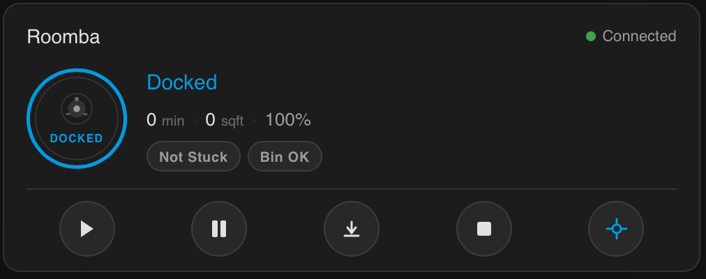
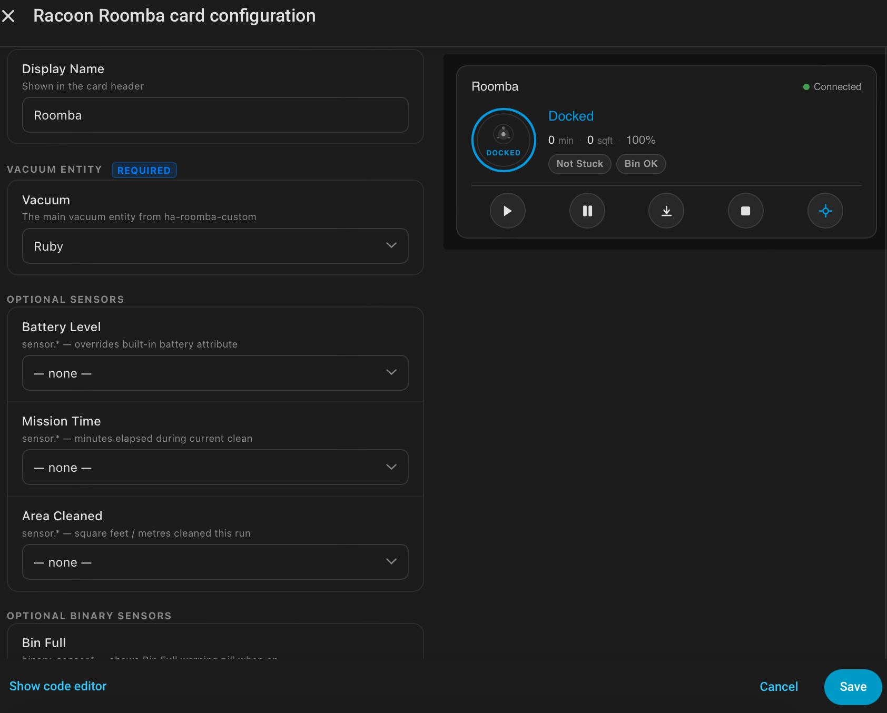

# 🦝 Racoon Roomba Card

[](https://github.com/hacs/integration)
[](LICENSE.md)

A compact, animated Lovelace card for controlling your Roomba from Home Assistant. Designed exclusively for use with the [**ha-roomba-custom**](https://github.com/jamesmcginnis/ha-roomba-custom) integration.

> ⚠️ **This card requires the [ha-roomba-custom](https://github.com/jamesmcginnis/ha-roomba-custom) integration to be installed first.**

---

## Preview




---

## Features

- Minimal, compact card that fits naturally in any dashboard layout
- **Connected** pill on the left, **battery %** pill on the right — turns amber below 40%, red below 20%
- Animated robot icon with spinning ring while cleaning — breathing + rotation effect
- Ring colour reflects vacuum state: green cleaning, blue docked, amber returning, red error
- Device name displayed inside the robot circle
- Five round control buttons: Start, Pause, Dock, Stop, Find
- Tap anywhere on the card to open the Home Assistant more-info popup
- Visual editor — no YAML required for basic setup

---

## Requirements

This card is designed to work with the **ha-roomba-custom** integration:

👉 [https://github.com/jamesmcginnis/ha-roomba-custom](https://github.com/jamesmcginnis/ha-roomba-custom)

Install that integration first, then add this card to your dashboard.

---

## Installation via HACS

Click the button below to add this repository directly to HACS:

[](https://my.home-assistant.io/redirect/hacs_repository/?owner=jamesmcginnis&repository=racoon-roomba-card&category=plugin)

Or add it manually:

1. Open **HACS** in your Home Assistant sidebar
2. Go to **Frontend**
3. Click the three-dot menu → **Custom repositories**
4. Add `https://github.com/jamesmcginnis/racoon-roomba-card` as category **Lovelace**
5. Search for **Racoon Roomba Card** and click **Install**
6. Reload your browser

---

## Manual Installation

1. Download `racoon-roomba-card.js` from this repository
2. Copy it to `/config/www/racoon-roomba-card.js`
3. In Home Assistant go to **Settings → Dashboards → Resources → Add Resource**
   - URL: `/local/racoon-roomba-card.js`
   - Type: **JavaScript module**
4. Reload your browser

---

## Configuration

### Minimal (required)

```yaml
type: custom:racoon-roomba-card
entity: vacuum.roomba
```

### Full configuration

```yaml
type: custom:racoon-roomba-card
entity: vacuum.roomba
name: Downstairs Roomba
battery_entity: sensor.roomba_battery
```

### Options

| Option | Type | Required | Default | Description |
|---|---|---|---|---|
| `entity` | string | ✅ | — | Your `vacuum.*` entity from ha-roomba-custom |
| `name` | string | | `Roomba` | Display name shown inside the robot circle |
| `battery_entity` | string | | — | `sensor.*` — overrides built-in battery attribute |

---

## Related

- **ha-roomba-custom integration** — [github.com/jamesmcginnis/ha-roomba-custom](https://github.com/jamesmcginnis/ha-roomba-custom)

---

## License

MIT © [jamesmcginnis](https://github.com/jamesmcginnis)
